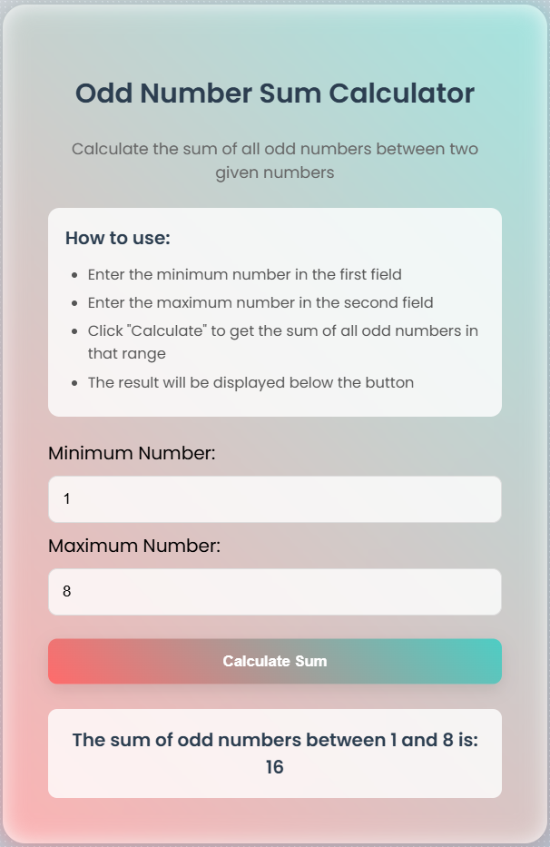

# 🔢 Odd Sum Calculator

A simple web-based calculator that computes the sum of **odd numbers** in a given range between a minimum and maximum value.

---

## ✨ Features

- Input a minimum and maximum number.
- Calculates the sum of all **odd** integers between them (inclusive).
- Clean and responsive user interface using **HTML, CSS, and JavaScript**.
- No backend required — all logic runs in the browser.

---

## 📸 Preview

---

## 🚀 Getting Started

1. Clone this repository or download the ZIP.
2. Open the `index.html` file in any modern web browser.
3. Enter the Min and Max values.
4. Click **Calculate** to see the result.

---

## 🔧 Project Structure

